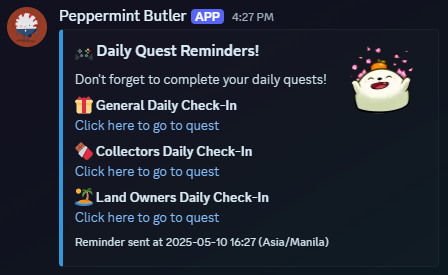

# Peppermint Butler

A customizable Discord bot that sends daily quest reminders directly to users through DMs. Users can set their preferred reminder time and receive notifications with embedded links to complete their daily quests.

Sample `/setreminder` command


Sample alert sent to your dm



## Quest Links

The bot reminds users about the following daily quests:
- 🎁 General Daily Check-In
- 🍫 Collectors Daily Check-In
- 🏝️ Land Owners Daily Check-In

## Commands

- `/setreminder [time] [timezone]` - Set your reminder time with timezone
  - Example: `/setreminder 14:00 Asia/Manila` (sets reminder for 2 PM in Manila timezone)
  - Example: `/setreminder 08:30 US/Eastern` (sets reminder for 8:30 AM in Eastern US timezone)

- `/checkreminder` - Check your current reminder settings and see the current time in your selected timezone

- `/stopreminder` - Stop receiving daily reminders

- `/listtimezones` - View a list of common timezones organized by region and get a link to all supported timezones

## Timezone Support

The bot supports 100+ timezones including:
- North America: US/Pacific, US/Eastern, America/New_York, etc.
- Europe: Europe/London, Europe/Paris, Europe/Berlin, etc.
- Asia: Asia/Tokyo, Asia/Manila, Asia/Singapore, etc.
- Oceania: Australia/Sydney, Pacific/Auckland, etc.
- South America: America/Sao_Paulo, America/Buenos_Aires, etc.
- Africa: Africa/Cairo, Africa/Johannesburg, etc.
- General: UTC, GMT

When using the `/setreminder` command, you can search for your timezone with autocomplete.

## Setup and Installation

1. Set your Discord bot token in the environment variable:
```
DISCORD_BOT_TOKEN=your_token_here
```

2. Install the required dependencies:
```
pip install -r requirements.txt
```

3. Run the bot:
```
python main.py
```

## Requirements

- Python 3.8+
- discord.py
- python-dotenv
- pytz
- APScheduler
